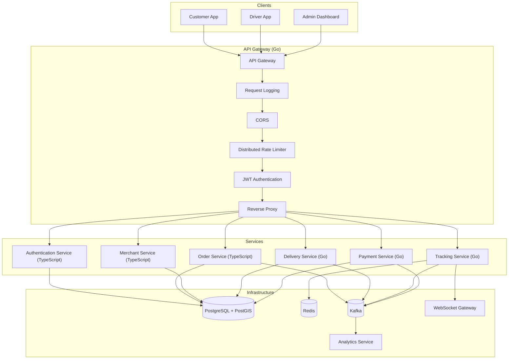

# Real-Time Food & Grocery Delivery Platform

> A production-inspired distributed backend system built with **Go**, **TypeScript**, **PostgreSQL/PostGIS**, **Redis**, **Kafka**, **gRPC**, and **WebSockets**.

---

## 📖 About

This project is my journey toward understanding how modern large-scale delivery platforms are engineered.

Instead of building another CRUD application, I'm focusing on solving real-world backend engineering problems such as:

* API Gateway Design
* Authentication & Authorization
* Distributed Rate Limiting
* Event-Driven Architecture
* Geospatial Queries
* Real-Time Driver Tracking
* Service-to-Service Communication
* Fault Tolerance
* Scalability
* Distributed Systems

The goal isn't simply to use these technologies—it's to understand **why they exist, what problems they solve, their trade-offs, and how they behave in production environments.**

---

# 🏗 High-Level Architecture



---

# 🛠 Technology Stack

## Backend

* Go
* TypeScript
* Bun
* Express
* Chi Router

## Databases

* PostgreSQL
* PostGIS
* Redis

## Messaging & Communication

* Kafka
* gRPC
* WebSockets

## Infrastructure

* Docker
* Kubernetes

## Testing

* Testcontainers
* k6

## Observability *(Planned)*

* OpenTelemetry
* Prometheus
* Grafana
* Jaeger

---

# 📚 Engineering Topics Covered

This project explores many concepts commonly used in production backend systems.

### API Layer

* API Gateway
* Reverse Proxy
* Middleware Pipeline
* JWT Authentication
* Distributed Rate Limiting

### Distributed Systems

* Redis Lua Scripting
* Event-Driven Architecture
* Kafka
* Service-to-Service Communication
* gRPC
* WebSockets
* Worker Pools
* Concurrency
* Idempotency

### Databases

* PostgreSQL
* PostGIS
* Spatial Queries
* Redis Caching

### System Design

* Hexagonal Architecture
* Strategy Pattern
* Unit of Work
* Circuit Breakers
* Retry Policies
* Fault Tolerance
* Horizontal Scaling

### DevOps

* Docker
* Kubernetes
* CI/CD

---

# 📂 Repository Structure

```text
tracking-system/

apps/
├── api-gateway/
├── auth-service/
├── order-service/
├── merchant-service/
├── delivery-service/
├── tracking-service/
└── payment-service/

infra/
├── docker/
├── kubernetes/
└── scripts/

docs/
├── architecture/
├── sequence-diagrams/
└── adr/

README.md
```

---

# 🚧 Current Progress

| Status | Component                             |
| ------ | ------------------------------------- |
| ✅      | Authentication Service                |
| ✅      | Go API Gateway                        |
| ✅      | Reverse Proxy                         |
| ✅      | Docker Setup                          |
| ✅      | Distributed Token Bucket Rate Limiter |
| ✅      | Redis Lua Scripting                   |
| 🚧     | Order Service                         |
| 🚧     | Merchant Service                      |
| 🚧     | Delivery Service                      |
| 🚧     | Tracking Service                      |
| ⏳      | Kafka Integration                     |
| ⏳      | WebSocket Gateway                     |
| ⏳      | PostGIS                               |
| ⏳      | gRPC                                  |
| ⏳      | Kubernetes                            |
| ⏳      | Distributed Tracing                   |
| ⏳      | Observability                         |

---

# 🎯 Roadmap

## Phase 1 — API Gateway

* ✅ Reverse Proxy
* ✅ Request Logging
* ✅ CORS
* ✅ Distributed Rate Limiter
* 🚧 JWT Verification
* 🚧 Health Checks

---

## Phase 2 — Merchant & Order Management

* Order Management
* Merchant Management
* Inventory
* PostGIS
* Geospatial Queries
* Strategy Pattern
* Transaction Management

---

## Phase 3 — Real-Time Tracking

* Tracking Service
* Driver Location Updates
* Redis GEO
* WebSockets
* Worker Pools
* Kafka Producer

---

## Phase 4 — Distributed Communication

* Kafka Consumers
* Billing Service
* gRPC
* Analytics
* Event Processing

---

## Phase 5 — Infrastructure

* Docker
* Kubernetes
* CI/CD
* Secrets Management

---

## Phase 6 — Testing

* Integration Tests
* Concurrency Tests
* k6 Load Testing
* Benchmarking

---

# 📖 Architecture Decision Records

The repository will also document **why** certain engineering decisions were made.

Examples include:

* Why use an API Gateway?
* Why Redis for distributed rate limiting?
* Why Lua instead of multiple Redis commands?
* Why Kafka instead of direct service communication?
* Why PostGIS for geospatial queries?
* Why Go for high-throughput services?

---

# 🎯 Project Goal

This project is designed as a learning platform for modern backend engineering.

The objective is to gain practical experience building scalable distributed systems while understanding the trade-offs behind every architectural decision.

Rather than relying heavily on frameworks or managed services, many components are intentionally implemented from scratch to better understand how production systems work internally.

---

## ⭐ If you find this project interesting, feel free to star the repository or share feedback.

Contributions, discussions, and suggestions are always welcome!
